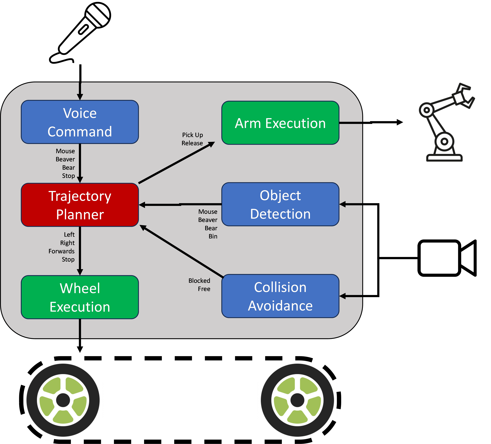

# CatToyCleaner
Project with WaveShare JETANK and NVIDIA Jetson Nano to clean up cat toys.

## Architecture

A workflow diagram is shown in Figure 1 for the Cat Toy Cleaner project.

Figure 1 Workflow Diagram for Cat Toy Cleaner

### Collision Avoidance

The *collision avoidance* task detects when the robot is close to a boundary and reports to the *trajectory planner* if the location in front of it is *blocked* or *free*. To keep the training simple and to avoid possibly hitting a wall or furniture, blue painting tape marks the boundary that the robot will be trained to avoid as shown in Figure 2.

Figure 2 Blocked/Free Detection for Collision Avoidance

### Object Detection

The *object detection* task detects toys (i.e., *mouse, beaver, and bear*) and *bin* that are in view of the camera as shown in Figure 3. It sends the *trajectory planner* each object it sees and left/right/in-front reference location.

Figure 3 Toy and Bin Detection

### Voice Command

The *voice command* task detects wake words (i.e., *mouse, beaver, bear, and stop*). It sends these words to the *trajectory planner.*

### Trajectory Planner

A flow diagram for the trajectory planner is shown in Figure 4. It information provided by input tasks to makes decision for wheel and arm commands.

Figure 4 Trajectory Planner Flow Diagram

### Wheel Execution

The *wheel execution* task is responsible to moving the robot *left, right, forward, or stop*.

### Arm Execution

The *arm execution* task is responsible to *pick-up* or *release* a toy.

## Data Collection

### Gamepad Control

To help facilitate data collection, a notebook was developed where a gamepad controller it utilized to move the robot and take snapshots.

